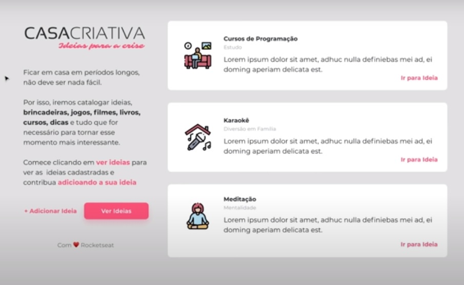

Desenvolvimento Web 

Desenvolver uma aplicação web a partir de um design web já desenvolvido de um projeto para cadastrar ideias.

---

#### WorkshopDev Especial | Episódio 1/5 

- [ ] 1. Introdução à programação WEB
- [x] 1. 1. O que é programação ?
- [x] 1. 1. 1. Ensinar o computador
- [x] 1. 1. 1. 1. Algoritmo 
- [x] 1. 1. 1. 1. 1. Passo a passo
- [x] 1. 1. 1. 1. 2. Conjunto de regras
- [x] 1. 1. 1. 2. Lógica de Programação 
- [x] 1. 1. 1. 2. 1. Maneira de pensar 
- [x] 1. 1. 1. 3. Sintaxe
- [x] 1. 1. 1. 3. 1. Maneira correta de escrever
- [x] 1. 2. Qual linguagem de programação ?
- [x] 1. 2. 1. Javascript
- [x] 2. Ambiente de Desenvolvimento 
- [x] 2. 1. Instalar o VSCode
- [x] 2. 2. Instalar o Node.js - Versão LTS v12.18.0 - v13.2.0
- [x] 2. 3. Instalar o Google Chrome
- [x] 3. Front-End e Back-End 
- [x] 3. 1. Imagina que ...
- [x] 3. 1. 1. Cliente chama, servidor escuta e responde
- [x] 3. 2. Como é feita a comunicação ?
- [x] 3. 2. 1. HTTP - HyperText Transfer Protocol
- [x] 3. 2. 2. URL - Localização universal 
- [x] 3. 2. 3. Troca de dados - pedido e resposta 
- [x] 3. 3. Tecnologias 
- [x] 3. 3. 1. Html - Estrutura 
- [x] 3. 3. 2. CSS - Estilização
- [x] 3. 3. 3. Javascript - Regras de Negócio

#### Comentários no decorrer da implementação
1. 

---
 
.: Por Douglas A B Novato - @douglasabnovato
- De Mayk Brito [Canal no Youtube - Rocketseat](https://www.youtube.com/playlist?list=PL85ITvJ7FLohGTWaE_p0J6B-TLmQbN4ka)